# DevOps Tooling Solution — 3-Tier Web Application

A highly available 3-tier web application infrastructure built on **AWS EC2**, using multiple web servers, a dedicated MySQL database server, and an NFS server for shared application and log storage.

---

- [DevOps Tooling Solution — 3-Tier Web Application](#devops-tooling-solution--3-tier-web-application)
- [1. Project Overview](#1-project-overview)
- [2. Architecture](#2-architecture)
- [3. Preparing NFS Server](#3-preparing-nfs-server)
- [4. Configure the Database Server](#4-configure-the-database-server)
- [5. Preparing the Web Servers](#5-preparing-the-web-servers)
- [5.1 Web Server 1](#51-web-server-1)
- [5.2 Web Server 2](#52-web-server-2)
- [5.3 Web Server 3](#53-web-server-3)
- [6. Tooling Configuration](#6-tooling-configuration)
- [From Web Server 2](#from-web-server-2)
- [From Web Server 3](#from-web-server-3)
- [7. Lessons Learned](#7-lessons-learned)
  - [7.1 Shared Storage](#71-shared-storage)
  - [7.2 Separation of Responsibilities](#72-separation-of-responsibilities)
  - [7.3 Centralized Database](#73-centralized-database)
  - [7.4 Linux Security](#74-linux-security)
- [Conclusion](#conclusion)

---

# 1. Project Overview

This project demonstrates the deployment of a **3-tier web application architecture** using AWS infrastructure.

The application consists of:

1. **Shared Storage Tier**

   * Dedicated NFS server
   * Shared application files
   * Shared Apache logs
   * Shared storage for other application data


2. **Database Tier**

   * Dedicated MySQL database server
   * Centralized application database

3. **Web Tier**

   * Three Apache web servers
   * PHP/PHP-FPM
   * Shared application files through NFS


The objective is to demonstrate practical DevOps concepts including:

* Linux server administration
* AWS EC2
* EBS storage
* LVM
* NFS
* Apache
* PHP-FPM
* MySQL
* SELinux
* Network communication between application tiers
* Shared storage
* Multi-server application deployment
* Troubleshooting and system diagnosis

---

# 2. Architecture

The overall architecture is:

```text
                         INTERNET
                            |
                            |
                        NFS Server 
                            |
                            v
                    +----------------+
                    | /mnt/apps      |
                    | /mnt/logs      |
                    | /mnt/opt       |
                    +----------------+
                       /    |    \
                      /     |     \
                     v      v      v
                    Web 1  Web 2  Web 3
                            |
             +--------------+--------------+
             |              |              |
             v              v              v
      +-------------+ +-------------+ +-------------+
      | Web Server 1| | Web Server 2| | Web Server 3|
      |   Apache    | |   Apache    | |   Apache    |
      |   PHP-FPM   | |   PHP-FPM   | |   PHP-FPM   |
      +-------------+ +-------------+ +-------------+
             |              |              |
             +--------------+--------------+
                            |
                            |
                  +-------------------+
                  |  MySQL Database   |
                  |     Server        |
                  +-------------------+
                            |
                       tooling DB


             
```

---

# 3. Preparing NFS Server

The NFS server provides shared storage to all web servers.

The NFS server contains:

```text
/mnt/apps
/mnt/logs
/mnt/opt
```


1.  Launching an EC2 instance that will server as "NFS Server" 


2.  Create 3 Elastic Block Storage (EBS) and attach it to the NFS server EC2


3.  Login into the EC2 via the linux terminal

```
ssh -i "key.pem" ec2-user@web-server-public-ip
```


4.  Check that block are attached to the web server

```
lsblk
```
   


5.  Update the web server

```
sudo yum -y update 
```


6.  Create a single partition on each of the 3 disks attached to the Database server

```
sudo fdisk /dev/nvme1n1
sudo fdisk /dev/nvme2n1
sudo fdisk /dev/nvme3n1
```

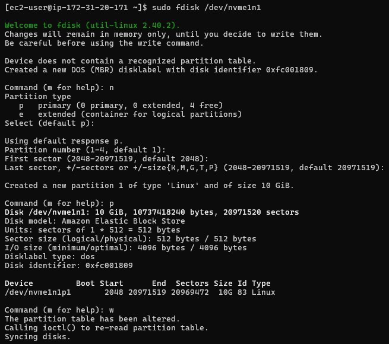
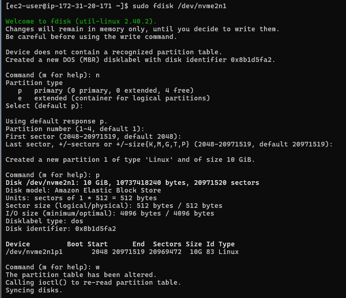


7.  Install the Logical Volume Manager (LVM)

```
sudo yum install lvm2 
```
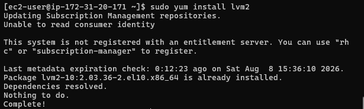


8.  Create Physical Volumes (PV) on each of the newly created partitions and verify the Physical volumes has been created successfully.

```
sudo pvcreate /dev/nvme1n1p1 /dev/nvme2n1p1 /dev/nvme3n1p1

sudo pvs
```

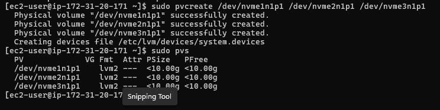


9.  Add all 3 PVs to a volume group and verify that the VG has been created successfully

```
sudo vgcreate webdata-vg /dev/nvme1n1p1 /dev/nvme2n1p1 /dev/nvme3n1p1

sudo vgs
```

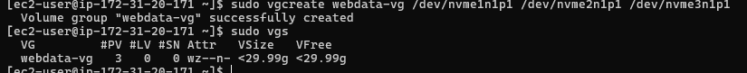

10.   Create 3 logical volumes (LV) from the volume group. Name it **"lv-apps"**, **"lv-opt"** and **"lv-logs"** and verify that the LV has been created successfully.

```
sudo lvcreate -L 10G -n lv-apps webdata-vg

sudo lvcreate -L 10G -n lv-opt webdata-vg

sudo lvcreate -L 5G -n lv-logs webdata-vg

sudo lvs
```

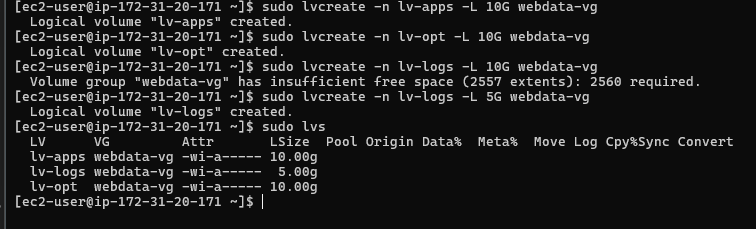


11.  list all blocks

```
lsblk
```


12.  Format the logical volumes with the xfs filesystem and verify that the LV has been formatted successfully.

```
sudo mkfs.xfs /dev/webdata-vg/lv-apps

sudo mkfs.xfs /dev/webdata-vg/lv-logs

sudo mkfs.xfs /dev/webdata-vg/lv-opt
```


13.  Create Mount directory for the logical volumes

lv-apps > /mnt/apps

lv-opt > /mnt/opt

lv-logs > /mnt/logs

```
sudo mkdir -p /mnt/apps

sudo mkdir -p /mnt/logs

sudo mkdir -p /mnt/opt
```


14.  Mount **/mnt/apps** on **lv-apps**
   
    Mount **/mnt/logs** on **lv-logs**

    Mount **/mnt/opt** on **lv-opt**

```
sudo mount /dev/webdata-vg/lv-apps /mnt/apps

sudo mount /dev/webdata-vg/lv-logs /mnt/logs

sudo mount /dev/webdata-vg/lv-opt /mnt/opt
```

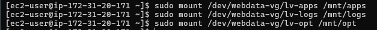


15.   Verify all setup

```
df -h
```

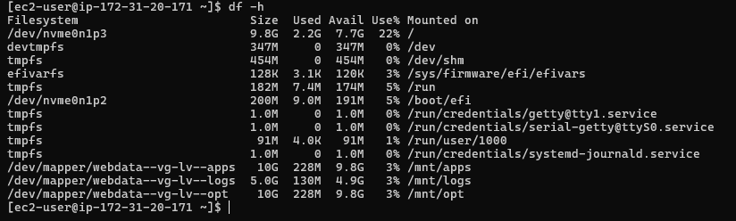


16.  list all blocks

```
lsblk
```

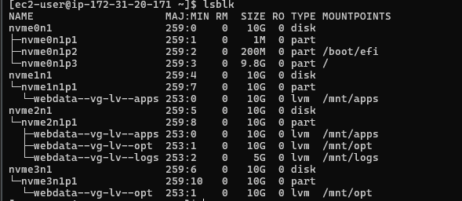


17. Check block UUIID for fstab configuration

```
sudo blkid
```

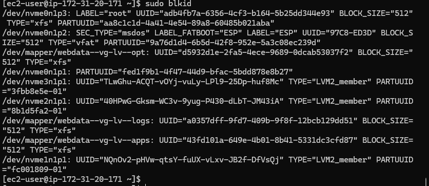


18.  Update **/etc/fstab** file to ensure that the mounted configuration persists after the restart of the server.

```
sudo vi /etc/fstab
```
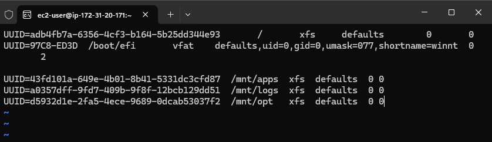


19.  Test the configuration and reload the daemon

```
sudo mount -a  

sudo systemctl daemon-reload
```


20.   Install NFS Server, configure it to start on reboot and ensure it is up and running

```
sudo yum install nfs-utils -y
sudo systemctl enable nfs-server.service
sudo systemctl start nfs-server.service
sudo systemctl status nfs-server.service
```


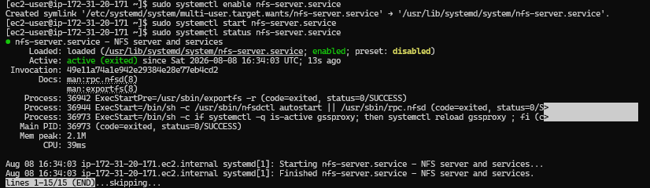


21.   Set up permission that will allow the Web Servers to read, write and execute files on NFS.
The exports were configured for the web-server network:


22.    Verify subnet CIDR ip address

```
hostname -I
ip route
```


23.   Export the mounts for Webservers' subnet cidr(IPv4 cidr) to connect as clients.
 ```text
/mnt/apps 172.31.16.0/20(rw,sync,no_all_squash,no_root_squash)
/mnt/logs 172.31.16.0/20(rw,sync,no_all_squash,no_root_squash)
/mnt/opt 172.31.16.0/20(rw,sync,no_all_squash,no_root_squash)

sudo exportfs -arv
```  


24.   Check which port is used by NFS and open it using the security group (add new inbound rule)

```
rpcinfo -p | grep nfs
```


**For NFS Server to be accessible from the client, the following ports added to the security inbound rules: TCP 111, UDP 111, NFS 2049. The Web Server subnet cidr was set as the traffic source.


# 4. Configure the Database Server


1.  Launching an EC2 instance that will server as "Database Server" 


2.  Login into the EC2 via the linux terminal

```
ssh -i "key.pem" ec2-user@web-server-public-ip
```


3. Update the Database server

```
sudo yum -y update 
```


4. Confirm MySQL package name on RHEL 10.2

```
sudo dnf search mysql | grep -i server
```


5. Install Mysql Server and ensure it us up and running
```
sudo dnf install -y mysql8.4-server

sudo systemctl enable mysqld
sudo systemctl start mysqld
sudo systemctl status mysqld
```


6. Create a database and name it tooling

Create a database user and name it webaccess

Grant permission to webaccess user on tooling database to do anything only from the webservers subnet cidr

```
sudo mysql

CREATE DATABASE tooling;
CREATE USER 'webaccess'@'172.31.16.0/20' IDENTIFIED WITH mysql_native_password BY 'Admin123@';
GRANT ALL PRIVILEGES ON tooling.* TO 'webaccess'@'172.31.16.0/20' WITH GRANT OPTION;
FLUSH PRIVILEGES;
show databases;

```


7. Set Bind Address and restart MySQL

```
sudo vi /etc/mysql/mysql.conf.d/mysqld.cnf
```


The command that was used shows an empty configuration file because the RHEL mysql configuration file directory is different from Ubuntu. Therefore i had to find the RHEL mysql configuration file directory using this command

```
sudo find /etc -name "my.cnf" -o -name "*.cnf" | grep mysql

```

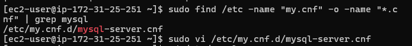

The RHEL mysql configuration file directory was displayed and the configuration file was updated with the new bind address

```
sudo vi /etc/my.cnf.d/mysql-server.cnf
```


8. Open MySQL port 3306 on the DB Server EC2.
Access to the DB Server is allowed only from the Subnet Cidr configured as source.


# 5. Preparing the Web Servers
Three independent EC2 instances were configured as web servers.

Each web server contains:

```text
Apache
   |
PHP-FPM
   |
PHP Application
   |
MySQL Database
```

The web servers use the same application files through the NFS server.


# 5.1 Web Server 1
1. Launch a new EC2 instance with RHEL Operating System


2. Login into the EC2 via the linux terminal

```
ssh -i "key.pem" ec2-user@web-server-public-ip
```


3. Install NFS Client

```
sudo yum install nfs-utils nfs4-acl-tools -y
```


4. Mount /var/www/ and target the NFS server's export for apps. NFS Server private IP address = 172.31.20.171

5. Verify that NFS was mounted successfully by running df -h. 

```
sudo mkdir /var/www
sudo mount -t nfs -o rw,nosuid 172.31.20.171:/mnt/apps /var/www

df -h
```

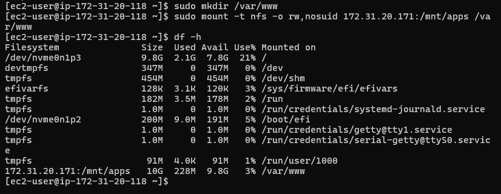


6. Update the fstab file to ensure that the changes will persist after reboot. 

```
sudo vi /etc/fstab

172.31.20.171:/mnt/apps /var/www nfs defaults 0 0
```


7. Install Apache, Remi's repository and PHP

```
sudo yum install httpd -y
```


```
sudo dnf install https://dl.fedoraproject.org/pub/epel/epel-release-latest-9.noarch.rpm
```

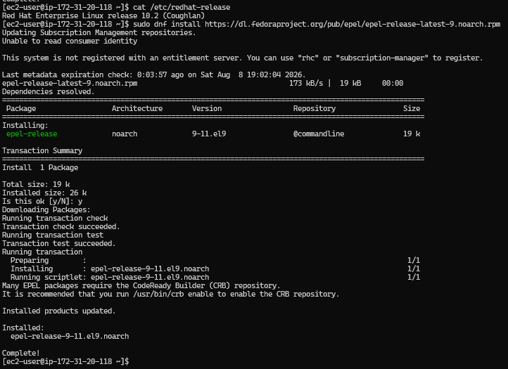

```
sudo dnf install dnf-utils http://rpms.remirepo.net/enterprise/remi-release-9.rpm
```
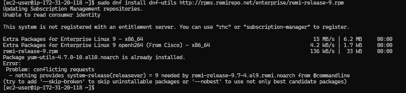

```
sudo dnf module reset php
```
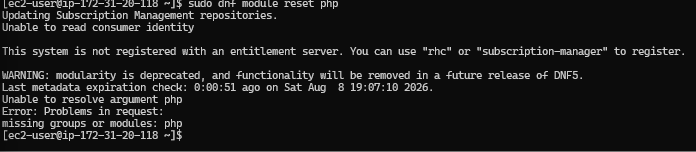


```
sudo dnf module enable php:remi-8.2
```

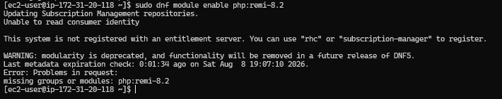

```
sudo dnf install php php-opcache php-gd php-curl php-mysqlnd
```

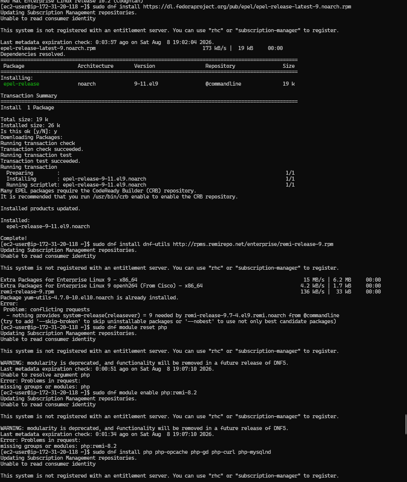


```
sudo systemctl start php-fpm
sudo systemctl enable php-fpm
sudo systemctl status php-fpm
```


# 5.2 Web Server 2
1. Launch a new EC2 instance with RHEL Operating System


2. Login into the EC2 via the linux terminal

```
ssh -i "key.pem" ec2-user@web-server-public-ip
```


3. Install NFS Client

```
sudo yum install nfs-utils nfs4-acl-tools -y
```


4. Mount /var/www/ and target the NFS server's export for apps. NFS Server private IP address = 172.31.20.171

5. Verify that NFS was mounted successfully by running df -h. 

```
sudo mkdir /var/www
sudo mount -t nfs -o rw,nosuid 172.31.20.171:/mnt/apps /var/www

df -h
```

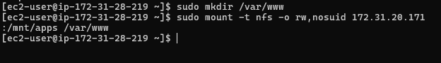


6. Update the fstab file to ensure that the changes will persist after reboot. 

```
sudo vi /etc/fstab

172.31.20.171:/mnt/apps /var/www nfs defaults 0 0
```


7. Install Apache, Remi's repository and PHP

```
sudo yum install httpd -y
```


```
sudo dnf install https://dl.fedoraproject.org/pub/epel/epel-release-latest-9.noarch.rpm
```

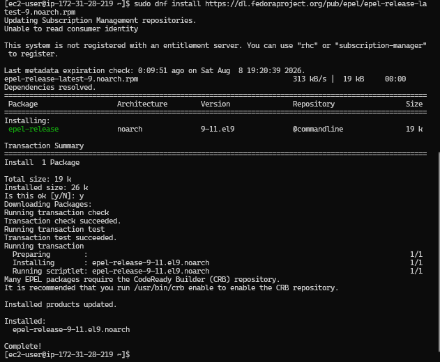

```
sudo dnf install dnf-utils http://rpms.remirepo.net/enterprise/remi-release-9.rpm
```
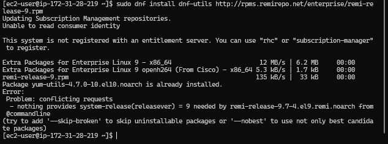

```
sudo dnf module reset php
```
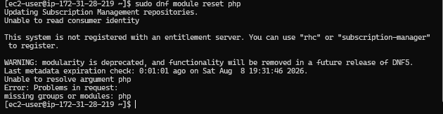


```
sudo dnf module enable php:remi-8.2
```


```
sudo dnf install php php-opcache php-gd php-curl php-mysqlnd
```

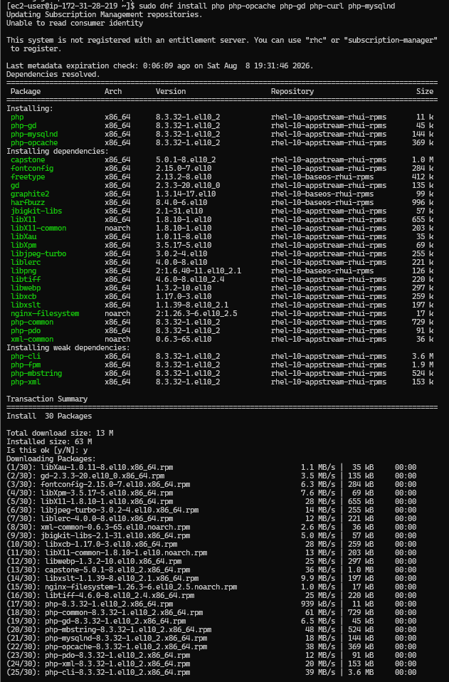


```
sudo systemctl start php-fpm
sudo systemctl enable php-fpm
sudo systemctl status php-fpm
```


# 5.3 Web Server 3
1. Launch a new EC2 instance with RHEL Operating System


2. Login into the EC2 via the linux terminal

```
ssh -i "key.pem" ec2-user@web-server-public-ip
```


3. Install NFS Client

```
sudo yum install nfs-utils nfs4-acl-tools -y
```


4. Mount /var/www/ and target the NFS server's export for apps. NFS Server private IP address = 172.31.20.171

5. Verify that NFS was mounted successfully by running df -h. 

```
sudo mkdir /var/www
sudo mount -t nfs -o rw,nosuid 172.31.20.171:/mnt/apps /var/www

df -h
```

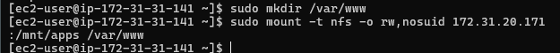

6. Update the fstab file to ensure that the changes will persist after reboot. 

```
sudo vi /etc/fstab

172.31.20.171:/mnt/apps /var/www nfs defaults 0 0
```


7. Install Apache, Remi's repository and PHP

```
sudo yum install httpd -y
```


```
sudo dnf install https://dl.fedoraproject.org/pub/epel/epel-release-latest-9.noarch.rpm
```

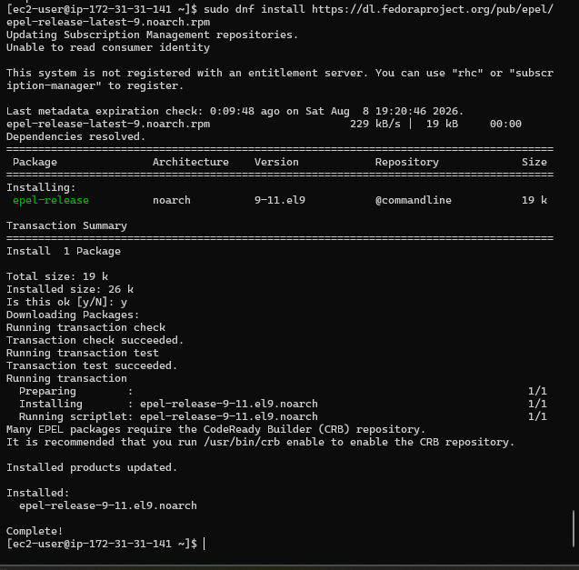

```
sudo dnf install dnf-utils http://rpms.remirepo.net/enterprise/remi-release-9.rpm
```
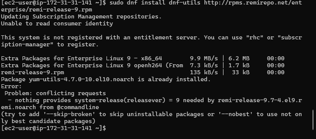

```
sudo dnf module reset php
```
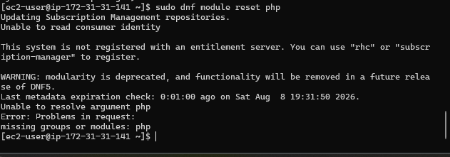


```
sudo dnf module enable php:remi-8.2
```


```
sudo dnf install php php-opcache php-gd php-curl php-mysqlnd
```

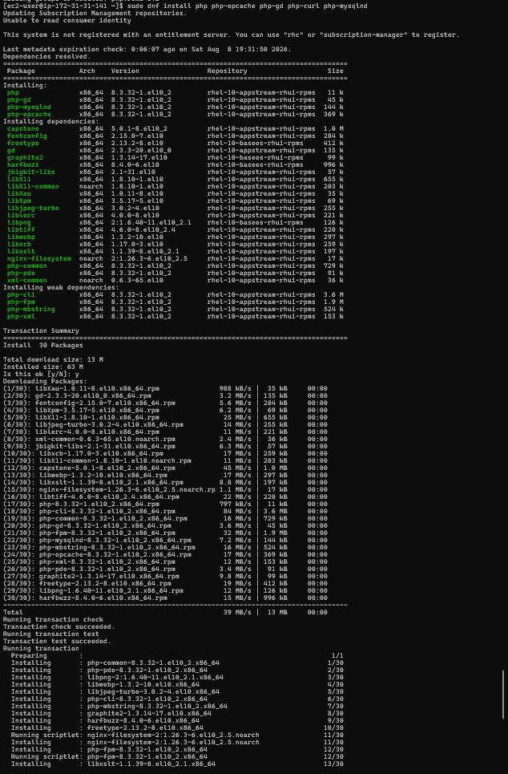


```
sudo systemctl start php-fpm
sudo systemctl enable php-fpm
sudo systemctl status php-fpm
```


# 6. Tooling Configuration

1. Verify that Apache files and directories are available on the Web Servers in /var/www and also on the NFS Server in /mnt/apps. Confirm that the NFS was mounted correctly by checking if the same files are present in both server. 
   


File.txt file was created from Web Server 1, and it was accessible from Web Server 2.


2. Locate the log folder for Apache on the Web Server and mount it to NFS server's export for logs. Update the etc/fstab file to ensure that the mount persists.


```
ls /var/log

sudo vi /etc/fstab
```


3. Fork the tooling source code from StegHub GitHub Account


4. Deploy the tooling Website's code to the Web Server. Ensure that the html folder from the repository is deplyed to /var/www/html

Install Git and clone the repository

```
sudo yum install git
sudo git clone https://github.com/StegTechHub/tooling.git
```

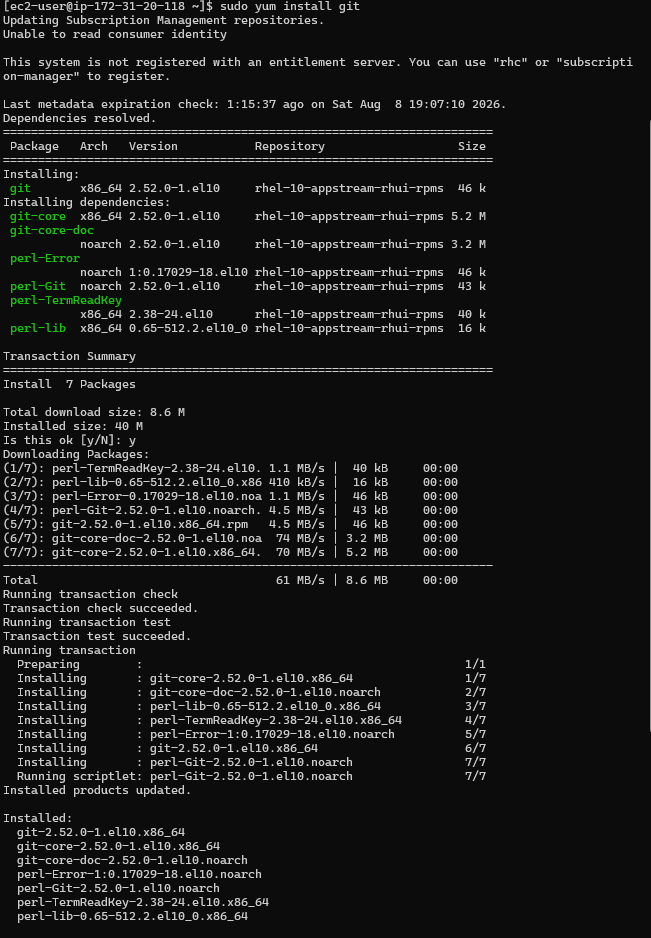


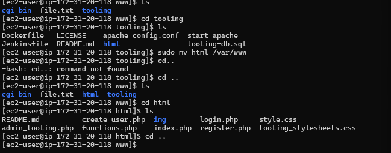


5. Open selinux file and set selinux to disable to make the change permanent.

```
sudo vi /etc/sysconfig/selinux

SELINUX=disabled
```

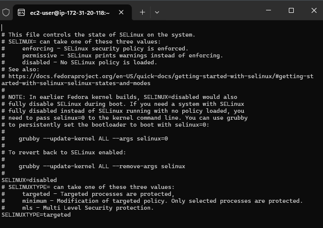

6. Update the website's configuration to connect to the database (in /var/www/html/function.php file). 

```
sudo vi /var/www/html/functions.php
```


7. Apply tooling-db.sql to the database server

``` sudo mysql -h <db-private-IP> -u <db-username> -p <db-password < tooling-db.sql
```


The server does not recognize the file because the command was made from the server root directory not the /var/www/tooling.


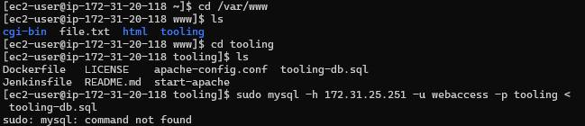

The directory was changed to the tooling directorr but the server does not recognize the commad because the mysql client has not been installed on any of the web servers.

Install Mysql client


After the Mysql client installation, the tooling-db.sql application was retried once again and the server detect an error stating that the user already exists on the database.


Verify the user on the database for confirmation


In order to successfully apply the tooling-db.sql, the existing database was dropped and recreated.


Database Application successful

8. Access the database server from Web Server
9. Create in MyQSL a new admin user with username: myuser and password: password

```
sudo mysql -h 172.31.8.129 -u webaccess -p

INSERT INTO users(id, username, password, email, user_type, status) VALUES (2, 'myuser', '5f4dcc3b5aa765d61d8327deb882cf99', 'user@mail.com', 'admin', '1');
```


1.   Open a browser and access the website using the Web Server public IP address http://<Web-Server-public-IP-address>/index.php. 


# From Web Server 2

i tried accessing the website from the web server 2 but the site refused to load stating and error 500.

While going through the troubleshooting process, i realized that the
SELinux remains enabled in enforcing mode.

Instead of disabling SELinux to make the application work, the required policy was enabled:

```bash
sudo setsebool -P httpd_can_network_connect_db on
```

This is preferable to disabling SELinux entirely.

After disabling the SELinux, i retried accessing the website from server 2 and it was successful


# From Web Server 3


---

# 7. Lessons Learned

This project provided practical experience with several important DevOps concepts.

## 7.1 Shared Storage

NFS allows multiple servers to access the same application files.

This means:

```text
Web 1
Web 2
Web 3
```

can all serve the same application without maintaining separate copies of the application files.

---

## 7.2 Separation of Responsibilities

The architecture separates:

```text
Web Layer
Database Layer
Storage Layer
```

This makes the infrastructure easier to scale and maintain.

---

## 7.3 Centralized Database

Instead of installing MySQL on every web server, a dedicated database server is used.

```text
Web 1 ─┐
Web 2 ─┼──> MySQL
Web 3 ─┘
```

This provides a centralized source of application data.

---

## 7.4 Linux Security

A service being "running" does not necessarily mean that it can perform every operation it needs.

In this project:

```text
Apache = running
PHP-FPM = running
MySQL = running
Network = available
```

but:

```text
SELinux = blocking PHP → MySQL
```

The issue was diagnosed through SELinux audit logs.

This demonstrates why DevOps engineers must understand both:

* application configuration
* operating-system security policies


---

# Conclusion

This project demonstrates a practical **3-tier DevOps infrastructure** consisting of multiple Apache/PHP web servers, a centralized MySQL database server, and shared NFS storage.

The project also demonstrates real-world Linux administration and troubleshooting, particularly the interaction between:

```text
Apache
   ↓
PHP-FPM
   ↓
SELinux
   ↓
Network
   ↓
MySQL
```

A key troubleshooting lesson was that an HTTP 500 error does not necessarily mean Apache is broken. The application may be running correctly while an underlying operating-system security policy prevents it from communicating with another service.
